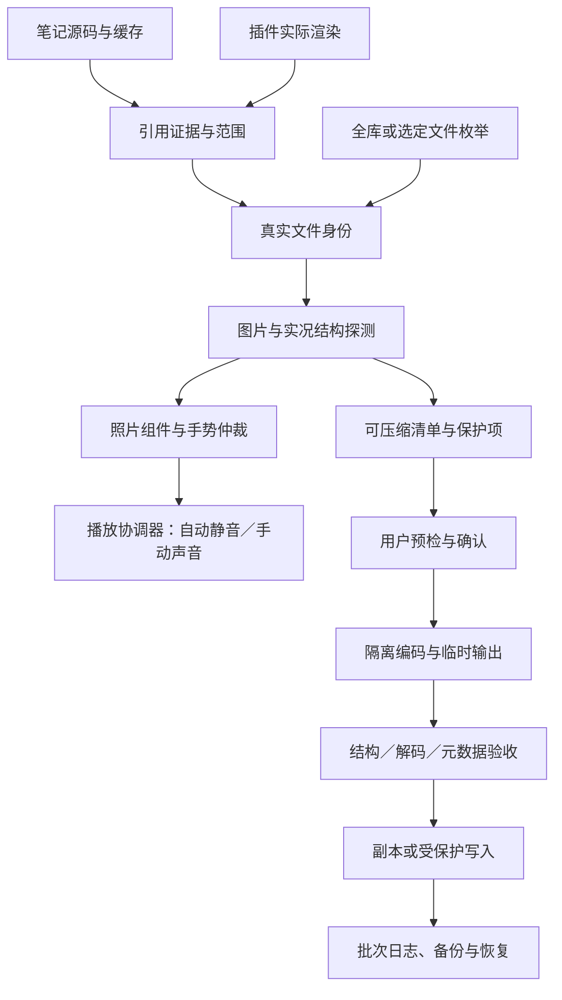

# Live Media：完整调研与开发报告

版本：设计 v2；日期：2026-10-06  
状态：仅文档，尚未实施插件；本文件取代上一版开发设计。  
实施备注：上行及“本轮仅文档”段落记录设计阶段当时状态；用户已批准后续开发。当前实现和验收以[实施追踪](实施计划.md)及[复检报告](复检报告.md)为准，不把本设计报告当成功验收记录。
工作区：独立桌面资料目录；当前知识库只读。

## 1. 已确定的产品要求

用户看到的是一张带实况标识的照片。点击照片可播放实况；自动播放始终静音。没有播放按钮、进度条、音量按钮、暂停图标、时间数字或任何视频播放器外观。

播放技术可使用 video 解码，但用户界面必须保持照片样式，不能把照片替换成带控件的视频卡片。LIVE 标识仅作标记，不是按钮。

本轮只重写完整报告与复检记录，不写实现、测试代码或 workflow，不初始化软件依赖，不编译、不安装插件、不上传用户照片、不推送仓库。

正式开发流程已确定：写源码 → 推送 GitHub → Actions 编译与自动测试 → 下载同一提交的原始产物 → 进行 Obsidian 与手机实机测试。本地不编译，不用本地重建包替代 Actions 产物。

### 1.1 不能被配置突破的约束

- 所有自动来源，包括首次预览、滚入可视区、悬停和自动循环，都必须静音。
- 图片区域永不显示播放器控件或额外操作按钮；不设置“显示视频控件”的选项。
- 不把浏览器禁止有声播放的情况变成自动解除静音。
- 未能证明保护实况结构、配对、音轨和必要元数据时，不覆盖原件。
- 不自动删除未引用图片，不自动搬移或统一命名，不后台压缩。
- 本地不编译；所有可自动化的构建和测试在 Actions 执行。
- 不复用 Live Photo Viewer 的实现代码；独立实现可使用正式登记的通用依赖。

其他有意义的用户选择都必须有默认值、说明、范围、重置入口及有效值校验。平台实际能力、文件是否损坏等是只读结果，不能由设置伪造。

## 2. 重新调研的结论与证据

下面区分源码事实、官方 API 行为、设计决策和待验证能力。参考项目的许可证与固定版本只用于研究记录，不代表已采用其实现。

| 研究对象 | 已核查事实 | 对本设计的影响 |
|---|---|---|
| Obsidian 后处理与 CodeMirror 扩展 | 阅读渲染与编辑渲染分别接入；渲染组件有独立生命周期 | 两条宿主入口，共用照片组件；不递归修改编辑器 |
| Simple Gallery 1.8.3 | 列表语法解析后生成普通 img，文件由 Obsidian 解析；真实拖拽与点击需要区分 | 通用资源识别可覆盖；实况点击不能破坏拖拽、标题和菜单 |
| Fullscreen Image 源码 | 在 document 的捕获阶段接管图片 click | 通用播放与大图查看器存在手势冲突，不能承诺同一点击各做各的 |
| Live Photo Viewer 本地 0.0.7 | 有阅读／编辑入口、图片交互及 Blob 视频提取；与固定上游提交存在差异 | 抽取职责和行为契约，独立设计结构验证、缓存与销毁 |
| Chrome／WebKit 自动播放规则 | 静音与用户手势播放有不同条件，play 返回值可能拒绝 | 自动静音是代码不变量；有声播放只从真实用户动作触发 |
| VideoFrame 回调与可视区观察 | 可以按已显示的视频帧切换覆盖层，按可视范围调度 | 避免黑闪、布局跳动与滚动时大量同时播放 |
| Android Motion Photo／Ultra HDR | 资源布局、实况时间信息与 gain map 都参与文件有效性 | 可播放不是可安全重写；视频单独压缩与 HDR 图片重编码分开 |
| libultrahdr | 有输入压缩基础图与 gain map 的组合接口，另有真正的 HDR 编码路径 | 是 HDR 写入的候选依赖，不能把“拼装保留”误当“图片已压缩” |
| GitHub Actions／Obsidian 发布机制 | 构建产物可下载；社区安装读取 release 的插件文件 | 构建一次，跨阶段复用同一产物；不能依赖安装器未下载的资源 |

关键证据：

- [Obsidian Markdown 后处理与生命周期](https://github.com/obsidianmd/obsidian-developer-docs/blob/c56c7e770ba25dd0ea392aacf4588f9425970d36/en/Plugins/Editor/Markdown%20post%20processing.md)、[编辑器扩展](https://github.com/obsidianmd/obsidian-developer-docs/blob/c56c7e770ba25dd0ea392aacf4588f9425970d36/en/Plugins/Editor/Editor%20extensions.md)。
- [Simple Gallery 语法与资源解析](https://github.com/haivri/obsidian-simple-gallery/blob/1d3d9cead604dc27dec4788cae8022e981856221/src/main.ts#L405)、[拖拽和点击说明](https://github.com/haivri/obsidian-simple-gallery/blob/1d3d9cead604dc27dec4788cae8022e981856221/src/main.ts#L1237)。
- [Fullscreen Image 捕获阶段点击入口](https://github.com/haivri/obsidian-fullscreen-image/blob/ad133cf23964743aa8b33d2baffa0a1cf6c0a496/src/main.ts#L593)。
- [Chrome 播放策略](https://developer.chrome.com/blog/autoplay/)、[WebKit 行内与静音规则](https://webkit.org/blog/6784/new-video-policies-for-ios/)、[play 返回值与拒绝处理](https://developer.mozilla.org/en-US/docs/Web/API/HTMLMediaElement/play)。
- [Android 实况规范](https://developer.android.com/media/platform/motion-photo-format)、[Ultra HDR 规范](https://developer.android.com/media/platform/hdr-image-format)。
- [libultrahdr 固定提交接口](https://github.com/google/libultrahdr/blob/66821e0a261aa3a06c0e7c889f52eced52850be1/ultrahdr_api.h#L354)。
- [Obsidian Actions 发布指南](https://github.com/obsidianmd/obsidian-developer-docs/blob/main/en/Plugins/Releasing/Release%20your%20plugin%20with%20GitHub%20Actions.md)、[GitHub 产物下载](https://docs.github.com/en/actions/how-tos/manage-workflow-runs/download-workflow-artifacts)。

这些资料证明所依据的 API 和参考行为，不证明新插件已兼容实际 Obsidian 或全部手机。

## 3. 完整功能范围

F 编号用于实现、测试与验收追踪。核心与实用功能均进入设计范围；不能以一个格式成功代表全部完成。

| 编号 | 功能 | 实现要求／完成条件 |
|---|---|---|
| F01 | 通用引用检测 | 源码、原生缓存、渲染结果、声明式规则合并；证据分级 |
| F02 | 原文件身份解析 | 相对笔记解析、同名消歧、缩略图／原图区分、改名移动更新 |
| F03 | 图片与实况探测 | 魔数、容器、XMP、配对与保护项；解析／播放／压缩分别报告 |
| F04 | 照片式行内播放 | 图片表面触发、原始布局保留、无控件、无黑闪 |
| F05 | LIVE 标识客制化 | 图形、文字、位置、大小、颜色、透明度与显示条件 |
| F06 | 静音自动播放 | 首次可见／每次进入／循环／悬停；有界并发、冷却与取消 |
| F07 | 手动有声播放 | 真实手势、音量偏好、单一声音来源、拒绝后静音降级 |
| F08 | 手势与插件仲裁 | 点击、触摸、拖拽、右键、修饰键、查看器冲突有明确规则 |
| F09 | 当前文章／选定文件／全库扫描 | 范围明确，支持筛选、去重、动态来源分组 |
| F10 | 普通图片压缩 | 格式、方向、透明度、色彩、必要元数据保护 |
| F11 | JPEG 实况视频单独压缩 | 图片资源不重编码；重写实况布局并完整验证 |
| F12 | 已验证实况双重压缩 | 静态图与视频分别编码，再重组；HDR 必须有有效写入能力 |
| F13 | Apple 配对支持 | 识别与播放；压缩保留身份和必要轨道，能力不足跳过 |
| F14 | HDR 与特殊格式保护 | 不静默变 SDR、不扁平化动画；明确保护跳过原因 |
| F15 | 批次预检与照片式对比 | 先显示范围、支持与影响；前后预览仍无播放器控件 |
| F16 | 串行队列、取消与重试 | 一次一个写入任务；部分结果真实可追溯 |
| F17 | 备份、恢复与崩溃检查 | 原件及配对组备份；恢复不得覆盖后续改动 |
| F18 | 指纹与重复压缩保护 | 同输入与配置不重复压缩；未知既有压缩状态不猜测 |
| F19 | 全局／平台／笔记／照片偏好 | 有默认、继承和重置，安全限制优先 |
| F20 | 性能与资源管理 | 按需读取、Worker、字节缓存、失效、回收和暂停 |
| F21 | 实况检查与脱敏报告 | 状态、元数据摘要、能力与故障定位；不导出私人正文 |
| F22 | 无障碍与主题 | 键盘等价操作、焦点、屏幕阅读、明暗主题与减少动态 |
| F23 | 跨平台与插件共存 | 桌面／Android／iOS 分能力矩阵；独立插件视图不强行接管 |
| F24 | Actions 构建与产物验证 | 唯一来源产物、SHA、测试证据、下载与实机记录 |

不增加素材管理系统、在线相册、上传服务、编辑裁剪器、AI 图片处理或未引用附件删除。这些不是实况播放与安全压缩的必要功能。

## 4. 总体架构与接口

接口职责：

| 模块 | 必需契约 |
|---|---|
| ReferenceProvider | 引用、来源、源码位置、证据等级、完整性声明、规则版本、取消与注销 |
| IdentityResolver | TFile、来源路径、资源映射、消歧结果、媒体组与指纹 |
| MediaProbe | 格式、布局、音视频、静态帧时间、HDR、配对、风险与支持程度 |
| PhotoHost | 来源叶子、宿主元素、原布局、可视性、销毁和事件归属 |
| PhotoController | 状态机、请求代号、手动／自动原因、声音许可、结束与静态图恢复 |
| PlaybackCoordinator | 活跃页面、自动名额、唯一有声来源、优先级与预算 |
| CodecBackend | 能力、输入保护项、受控参数、取消、临时输出和元数据保留报告 |
| ContainerWriter | 段／盒／索引重组，受保护数据验证；未知布局拒绝 |
| BatchService | 预检、确认、指纹、队列、备份、提交、冲突、恢复与报告 |
| SettingsService | 默认、验证、继承、迁移、导入导出、设备能力与冲突提示 |

正式工程按这些职责拆分，不把识别、播放、压缩、设置和 DOM 改动集中在 main.ts。所有异步请求带 AbortSignal 与代号；旧结果不能覆盖新图片或已销毁组件。

## 5. 通用兼容：不按插件名称逐个写识别器

### 5.1 三条识别通道

1. 原生缓存与 Markdown／HTML 结构：图片嵌入、引用式图片、picture、srcset、别名和尺寸。
2. 未知代码块的标准引用与声明式规则：列表、键值、JSON、YAML，不执行代码或插件查询。
3. 当前笔记内插件渲染出的图片：按 img.currentSrc、src 与登记资源地址确认 TFile，补充异步结果。

所有通道统一输出引用证据。出现标准图片节点且资源可映射的新插件，设计上可无需专用实现；简单新语法通过配置规则接入。不能将这个设计推断宣称为“所有插件已兼容”。

| 证据 | 默认处理 |
|---|---|
| 原生或已登记语法的直接引用 | 纳入当前文章预检 |
| 明确的动态查询展示／嵌入内容 | 单独分组，默认不勾选 |
| 未知代码块、裸路径、示例内容 | 待确认，默认不勾选 |
| 来源不明的缩略图、blob、data、私有资源 ID | 不猜原件，不覆盖 |

官方 embeds 缓存是原生嵌入数据，不能当作全部插件语法登记。[官方 CachedMetadata](https://github.com/obsidianmd/obsidian-api/blob/9abd9605ce081383674aae1ed111c456edde0688/obsidian.d.ts#L2391)。

### 5.2 不能省略的边界

- DOM 中的查询结果不等于该文章直接引用；尚未渲染的懒加载结果不能假装已全部发现。
- srcset 的资源可能是缩略图；有可信提供者映射才追溯原图。
- sourcePath 始终是实际来源笔记；嵌入笔记保留自身身份，避免相对路径解析错误。
- Canvas、封闭 Shadow DOM、加密内容和私有 ID 使用提供者接口或显式选择，不能靠扫字符串彻底解决。
- 规则只声明语言、字段、结构、路径基准和证据，不开放 eval 或任意 JavaScript。
- 不注册其他插件已有的代码块处理器；自有可选语法为 live-media。历史 live 别名默认关闭。
- 不依据未找到引用判断图片可删除；本插件没有自动删孤立图片功能。
- 不自动改写未知语法。副本默认不改链接；替换原件保持原路径与格式。
- 改名、移动、修改、删除会作废引用与媒体缓存；负向探测结果也必须失效。

全库模式枚举登记扩展名与媒体文件头，不依赖 Simple Gallery 引用是否进入缓存。枚举结果仍需探测，不凭 JPG 扩展名把它当普通静态图。

## 6. 照片式显示的完整实现细节

### 6.1 DOM 与排版

保留原 img、caption、替代文本、宽高、圆角、object-fit、响应式约束与图库尺寸逻辑。在可安全定位的图片宿主内创建非交互视频层和 LIVE 标识；视频层不参与布局，pointer-events 为 none。

原 img 保持布局和点击目标。首个视频帧确实呈现后才显露视频层，结束、取消或错误后回到原图；不得把 img 移出图库卡片，导致依赖 img 尺寸的布局器失效。

视频方向、display 宽高、裁切及 object-position 与照片宿主一起计算，不能把编码尺寸直接当显示尺寸；保留照片已有裁切，不加入电影式黑边。探测／加载时一直显示原图，不新增加载按钮或进度线。

video 永不启用 controls。设置 playsinline，禁用本插件的画中画／远程播放入口；浏览器扩展或第三方注入的控件不属于本插件可完全控制的范围。默认右键落到原图片，由宿主保留图片菜单。

使用 requestVideoFrameCallback 处理已呈现帧；不可用时以 playing／帧就绪与 requestAnimationFrame 降级，并实测无黑闪。[帧回调说明](https://developer.mozilla.org/en-US/docs/Web/API/HTMLVideoElement/requestVideoFrameCallback)。

布局不允许安全叠层时，保持静态图并记录宿主限制；不能强行全局改 position 或把所有 img 包一层。

### 6.2 LIVE 标识

默认右上角、细圆环加 LIVE 字样、跟随主题、非交互、无播放三角。标识不显示进度、不切换成暂停图标，不在播放中跳成工具栏。

用户可调整显示、形状／文字、位置、尺寸、间距、颜色、背景和透明度。文字长度与色彩值有约束，不接受任意 HTML／CSS。故障通过可选的系统提示与检查报告表达，不加图片上的重试按钮。

### 6.3 图片状态机

状态：静态／探测中／资源准备中／就绪／自动播放／手动播放／结束恢复／不可播放／已销毁。

| 事件 | 转移与动作 |
|---|---|
| 图片进入预算范围 | 探测，验证身份与媒体；保留静态图 |
| 视频准备完成 | 就绪；只有来源与能力可靠才登记可播放 |
| 自动条件成立 | 获得调度名额，强制静音，再启动 |
| 点击静态／自动播放照片 | 升为手动请求；默认从头完整播放，按声音偏好处理 |
| 再次点击手动播放照片 | 默认停止并回到静态图；可设为从头重播 |
| 自动结束／达到预览时长 | 静音状态结束，恢复静态图，写入本会话预览记录 |
| 手动结束 | 按用户次数重播；最终恢复原图 |
| 离开可视区／后台／组件卸载 | 按范围停止；不可继续在后台发声 |
| play 被拒绝或资源坏了 | 捕获错误；恢复静态图，不显示视频控件 |
| 文件修改、改名、换图 | 取消旧请求、更新身份，重新探测 |
| 重排导致 DOM 迁移 | 同一有效宿主可保留状态；移除后须及时销毁 |

每次播放以递增请求代号防止异步竞态。卸载、取消和第二次点击都使旧代号无效。

### 6.4 交互与无障碍

单击／轻触默认播放照片。图片宿主可聚焦，Enter／Space 等同点击；Escape 停止当前聚焦照片。保留原 alt，并补充非重复的实况描述和操作状态。

不新增可见按钮；焦点环只在键盘焦点时按主题出现。屏幕阅读器状态采用短文本提示，不能每一帧播报。减少动态偏好默认禁止自动播放，手动播放仍可用。[减少动态设置](https://developer.mozilla.org/en-US/docs/Web/CSS/Reference/At-rules/@media/prefers-reduced-motion)。

压缩和设置页面可以使用必要的原生表单操作；“无按钮／无进度条”约束适用于照片播放区域。压缩进度也优先用已完成数量与文字说明，不做播放器形态。

## 7. 自动播放、声音与多图协调

### 7.1 默认行为

自动播放默认开启“本会话首次可见预览”：可见比例至少 60%，稳定 400 ms，最多播放 3 秒、1 次、始终静音。同内容版本本会话内不因重渲染反复预览。

手动点击默认从头播放整段、1 次、允许声音、期望音量 80%。原视频无音轨时照常播放，不提示虚假错误。

点击一个照片时，先停止其他有声照片并释放其声音许可；同一插件实例下所有叶子和弹出窗口最多一个有声来源。其他自动任务始终静音。

### 7.2 可选自动模式

关闭／首次可见／每次进入可视区／可视区循环。悬停是独立可选触发，只产生静音播放；触屏设备忽略悬停设置。

可视比例采用进入／退出两个阈值形成滞回，默认进入 60%、退出 15%，避免滚动边缘频繁启停。离开后有冷却时间；被手动停止的照片至少在当前可视停留期间不重新自动启动。

自动并发默认 1，按可视面积、距中心和等待时间调度；手动请求优先。用户选择更多并发时仍受设备预算限制，实际生效值在设置显示。

auto.durationMs 是一次自动触发的总时间预算；次数达到或时间用完都停止。full 表示播放所选次数的完整片段。visible-loop 每轮受同一预算并经过冷却后重新申请名额，不使用一个无法协调的无限 loop。手动循环属于该次明确的手动会话，声音许可到离开／结束即失效，不能转移给下一次自动触发。

页面失去活跃状态、应用后台或窗口隐藏，自动与有声手动播放立即停止。前台回来只按配置重新触发静音预览，不恢复旧有声许可。

### 7.3 有声播放的实际限制

静音自动播放与真实手势中的有声播放必须分开实现；不得因为“以前点过一次”就让新自动播放出声。Chrome／WebKit 的政策资料不能替代 Obsidian WebView 实测。

可见照片预先在字节预算内准备视频，尽量让点击处理直接调用 play。若点击时还需异步提取，后续有声 play 可能失去手势条件；被拒绝时退回静音，并通过可关闭的系统提示说明“再次点击照片可尝试声音”，不添加解锁按钮。

默认不延迟 click 去等待 double-click，以免损失用户手势。双击不定义第二套播放功能；已有全屏查看由独立手势／修饰键或宿主策略处理。

音量在部分 WebView 受系统控制，设置必须说明实际支持程度。[volume 能力说明](https://developer.mozilla.org/en-US/docs/Web/API/HTMLMediaElement/volume)。无法设置时保留静音保证，手动声音使用系统音量；不能声称滑块已控制手机系统音量。

自动状态在发起、资源就绪、循环与恢复各处都检查 muted／声音许可。NotAllowedError 不循环重试，不借助虚构点击或隐藏音频解锁系统。

## 8. 点击、大图与图库兼容

### 8.1 点击归属

同一张实况照片的一次 click 不能同时保证“仅行内播放”与“让大图插件打开”。默认 **实况播放优先**：只接管已确认且可播放的实况照片点击。普通照片、菜单、caption、链接、修饰键动作和拖拽不接管。

用户可为宿主改成“查看器优先”，此时该宿主的普通点击沿用查看器，实况使用可配置的替代手势；设置必须提示这是对默认点击行为的覆盖。不能悄悄降级。

在登记的 ownerDocument 捕获阶段协调已绑定的照片事件；这是限定目标的事件仲裁，不是全局 DOM 观察。若另一个查看器更早在同一捕获层立即截断事件，登记兼容限制／调整该宿主策略，不轮询修改第三方源码。

不承诺第三方大图窗口也自动增强。默认仅当前笔记宿主；提供者确认弹窗来源和生命周期后才可扩展。第三方已有按钮属于该插件，本插件不新增播放器控件。

### 8.2 拖拽、滚动与触摸

跟踪 pointerId、主指针、移动距离、pointercancel、dragstart 和多指状态；原生 click 作为播放提交点。真实拖拽、滚动与缩放不得启动播放。

默认移动容差桌面 6 CSS px、触屏 12 CSS px，可修改。长按默认留给系统／宿主菜单；用户可明确选择长按播放，但只在支持的宿主启用，并说明菜单冲突。没有用户手势许可的定时长按只允许静音。

不全局 preventDefault，不禁止触屏滚动；视频层与 LIVE 标识不抢点击。拖动后抑制尾随 click 的规则只针对同一照片、同一指针会话，避免下一次真实点击被吞掉。[Pointer Events 规范入口](https://developer.mozilla.org/en-US/docs/Web/API/Pointer_events)。

## 9. 完整客制化设置规格

以下每一行都是拟实现的用户可改设置：给出唯一字段、类型／范围、默认值及实际含义。没有实现能力的项目必须禁用并解释，不能保存一个不起作用的开关。

默认与继承：安全不变量 > 本批次压缩选择 > 照片覆盖 > 笔记覆盖 > 平台配置 > 全局默认。播放设置中批次项不参与；来源身份与浏览器能力不是可覆盖参数。

### 9.1 显示与照片交互

| 字段 | 类型／范围 | 默认值 | 行为 |
|---|---|---|---|
| render.reading | 布尔 | true | 阅读视图增强 |
| render.livePreview | 布尔 | true | 实时预览增强，源代码编辑仍不改变 |
| render.gallery | 布尔 | true | 已绑定图库宿主增强 |
| badge.enabled | 布尔 | true | 显示非交互 LIVE 标识 |
| badge.style | ring-text／ring／text | ring-text | 圆环与文字，不提供三角播放形状 |
| badge.text | 文本 1—12 字符 | LIVE | 不接收 HTML |
| badge.position | 四角 | top-right | 位置 |
| badge.sizePx | 整数 12—32 | 18 | 图形尺寸 |
| badge.textPx | 整数 9—18 | 11 | 字号 |
| badge.offsetPx | 整数 0—24 | 8 | 边缘间距 |
| badge.opacity | 数字 0.2—1 | 0.9 | 不透明度 |
| badge.color | theme／合法颜色 | theme | 前景色 |
| badge.background | theme／transparent／合法颜色 | theme | 轻量底色 |
| badge.radiusPx | 整数 0—16 | 6 | 背景圆角 |
| badge.visibility | always／hover-focus | always | 触屏 hover-focus 按焦点／播放状态降级 |
| manual.enabled | 布尔 | true | 用户动作播放 |
| manual.gesture | click／double-click／long-press／modified-click | click | 非默认方式有平台与冲突说明 |
| manual.repeatAction | stop／restart | stop | 播放中再次点击 |
| manual.loopCount | 1—20／continuous | 1 | 整段重播次数；后台总是停止 |
| manual.sound | 布尔 | true | 仅真实手动请求允许声音 |
| manual.volumePercent | 整数 0—100 | 80 | 期望音量；不支持则用系统音量 |
| manual.resume | restart／resume | restart | 默认从头；资源回收后 resume 降级为从头 |
| gesture.mouseTolerancePx | 整数 2—20 | 6 | 点击与拖拽区分 |
| gesture.touchTolerancePx | 整数 4—30 | 12 | 轻触与滑动区分 |
| gesture.longPressMs | 整数 300—1200 | 500 | 仅 long-press 生效，不绕过声音策略 |
| gesture.modifier | alt／shift／ctrl-or-cmd | alt | modified-click 生效 |
| host.clickPriority | live／viewer | live | 实况与查看器仲裁，允许宿主单独覆盖 |
| host.passthroughModifier | alt／shift／ctrl-or-cmd／none | alt | live 优先时将指定手势交回宿主 |
| accessibility.keyboard | 布尔 | true | 聚焦后 Enter／Space／Escape |
| accessibility.respectReducedMotion | 布尔 | true | 用户可主动改变偏好；自动仍静音 |
| appearance.transitionMs | 整数 0—300 | 100 | 图片与动态层切换，减少动态时为 0 |

live 优先且两种组合同时生效时，manual.gesture 为 modified-click 不得与 host.passthroughModifier 相同；冲突保存前阻止并解释。viewer 优先时此宿主必须配置可用替代手势，不能保存“两个功能都接管普通 click”的配置。double-click 必须在第二次真实点击事件中发起手动播放，不用延迟单击伪造手势。

### 9.2 自动播放与调度

| 字段 | 类型／范围 | 默认值 | 行为 |
|---|---|---|---|
| auto.mode | off／first-visible／every-enter／visible-loop | first-visible | 本会话首次可见 |
| auto.durationMs | 500—10000／full | 3000 | 自动预览时间；不裁切源文件 |
| auto.loopCount | 整数 1—10 | 1 | 非 visible-loop 的次数 |
| auto.enterRatio | 数字 0.1—1 | 0.6 | 进入阈值 |
| auto.exitRatio | 数字 0—0.5 | 0.15 | 必须小于进入阈值 |
| auto.delayMs | 整数 0—2000 | 400 | 稳定可见后启动 |
| auto.cooldownMs | 整数 0—30000 | 5000 | 每次进入／循环间隔 |
| auto.concurrent | 整数 1—3 | 1 | 能力／预算可能降低实际值 |
| auto.hover | 布尔 | false | 桌面悬停预览，永远静音 |
| auto.hoverDelayMs | 整数 100—1500 | 250 | 桌面悬停延迟 |
| auto.hoverEnd | stop／finish-current | stop | 离开悬停的行为；离开页面立即停止 |
| auto.remember | session／persistent | session | 首次预览记录，可主动清除 |
| auto.scope | reading／reading-and-preview | reading-and-preview | 自动作用视图 |
| auto.mobile | 布尔 | true | 移动端自动预览；依能力降级 |
| auto.lowResource | stop／limit-one | limit-one | 预算不足时实际策略 |

auto.mode=off 时 hover 自动触发也停止，避免“关了自动播放仍悬停播放”。自动静音、后台停止和最多一个声音来源是硬约束，不提供关闭选项。

### 9.3 检测、规则与范围

| 字段 | 类型／范围 | 默认值 | 行为 |
|---|---|---|---|
| detect.native | 布尔 | true | 原生嵌入 |
| detect.html | 布尔 | true | HTML 与响应式图片 |
| detect.codeCandidates | 布尔 | true | 未知块中的标准引用作为候选 |
| detect.rendered | 布尔 | true | 当前宿主渲染补充 |
| detect.frontmatterFields | 字段列表 | cover, coverImage | 仅登记字段；默认列候选，未显示不自动处理 |
| detect.rules | 声明式规则列表 | 已验证 Simple Gallery 列表规则 | 语言／结构／字段／基准／证据 |
| detect.providers | 提供者开关表 | 安装后可用者开启 | 错误隔离，显示版本 |
| scope.includeFolders | 库内目录列表 | 空列表 | 空表示全库范围，无个人路径 |
| scope.excludeFolders | 库内目录列表 | 空列表 | 强制排除配置、回收站和自有工具目录另行说明 |
| scope.extensions | 扩展名列表 | jpg,jpeg,png,webp,gif,avif,heic,heif,tif,tiff,bmp,svg | 枚举不等于允许压缩 |
| scope.embeddedNotes | 布尔 | false | 包含嵌入笔记，保留来源 |
| scope.dynamicSelected | 布尔 | false | 动态展示默认勾选策略 |
| scope.order | document／path／size-desc | document | 当前文档默认源码顺序，全库降级 path |
| pairing.sameNameCandidates | 布尔 | true | 展示同名候选，不升级为可信原生配对 |
| pairing.explicit | 显式媒体组登记 | 空列表 | 用户确认播放，不能伪造 Apple 元数据 |
| compatibility.legacyLive | 布尔 | false | 历史 live 语法，检测所有权冲突 |
| compatibility.hostOverrides | 宿主策略表 | 空表 | 继承全局或单独禁用增强 |
| network.remote | 布尔 | false | 只允许用户手动读取远程媒体，自动播放不发起外部下载 |

### 9.4 压缩与画质

| 字段 | 类型／范围 | 默认值 | 行为 |
|---|---|---|---|
| compression.defaultScope | current-note／selected-files／vault | current-note | 每次执行仍显示清单 |
| compression.output | copy／replace | copy | replace 每批确认，保持原路径 |
| compression.preset | balanced／high／lossless／custom | balanced | 显示真实有效参数，不能泛称所有视频无损压缩 |
| compression.staticStrategy | lossless-first／reencode | lossless-first | 已验证静态格式无损优化优先；失败后须允许有损才重编码 |
| compression.allowLossy | 布尔 | true | 仅用户已选择的受支持路线 |
| compression.jpegQuality | 整数 50—100 | 85 | JPEG 有损编码 |
| compression.webpQuality | 整数 50—100 | 85 | 保留 WebP，动画保护 |
| compression.pngMode | lossless／skip | lossless | 不隐式降低透明或颜色精度 |
| compression.liveMode | video-only／photo-and-video／photo-only | video-only | 各路线需独立满足保护条件 |
| compression.videoQuality | balanced／high／custom | balanced | 后端映射与结果明示 |
| compression.ffmpegCrf | 整数 16—30 | 23 | 仅对应已验证 FFmpeg 后端 |
| compression.targetVideoMbps | 数字 0.5—50 | 6 | 仅固定码率后端生效，不同时当 CRF |
| compression.resizeImage | 布尔 | false | 显式缩放，不能自动改 HDR |
| compression.maxImageEdge | 整数 512—8192 | 2560 | resizeImage 开启才生效 |
| compression.resizeVideo | 布尔 | false | 显式缩放；方向与时间不变 |
| compression.maxVideoEdge | 整数 480—3840 | 1440 | 后端能力与偶数尺寸校验 |
| compression.minSavingPercent | 数字 0—50 | 5 | 更大输出永不自动替换 |
| compression.formats | 支持格式开关表 | 经验证格式开启 | 不能手工把不支持格式设成支持 |
| compression.backend | auto／webcodecs／wasm／native | auto | 只选已验证且在本机可用者 |
| compression.preserveExif | 布尔 | true | 允许清除普通可选 EXIF；受保护配对／方向等除外 |
| compression.preserveGps | 布尔 | true | 清除 GPS 必须明确选择；保留必要元数据 |
| compression.keepFileTimes | 布尔 | true | 尽力保留，不以 mtime 代替内容版本 |
| compression.includeShared | confirm／skip | confirm | 共享原件影响范围需确认 |
| compression.repeated | skip-owned／ask | skip-owned | 按指纹与日志判断，不猜第三方压缩历史 |

lossless 预设表示只使用已验证无损优化或重封装，无法缩小时跳过；它不承诺把有损视频重编码成“无损且更小”。音频默认原样保留，没有自动去音轨选项。保护 HDR、实况时间与配对的规则不能关闭。

### 9.5 资源、存储与诊断

| 字段 | 类型／范围 | 默认值 | 行为 |
|---|---|---|---|
| performance.cacheMiB | 整数 8—256 | 桌面 48／手机 16 | 仅媒体字节缓存，不冒充整个进程内存上限 |
| performance.cacheEntries | 整数 5—200 | 50 | 与字节上限同时生效 |
| performance.preload | visible／near-visible／manual | visible | 全库不预读全部文件 |
| performance.marginPx | 整数 0—1000 | 200 | near-visible 生效 |
| performance.probeConcurrent | 整数 1—4 | 2 | 探测分批 |
| performance.maxInputMiB | 整数 8—512 | 桌面 128／手机 32 | 超限跳过，可用户调整 |
| performance.maxPixelsMp | 整数 4—100 | 桌面 48／手机 16 | 避免超大解码；实际内存另核算 |
| performance.warmSeconds | 整数 0—60 | 10 | 离屏无引用资源的预热保留期 |
| performance.encodePriority | normal／low | low | 后端支持时执行 |
| storage.copyDirectory | 相对路径／alongside | alongside | 同目录安全副本；不自动改文章引用 |
| storage.copySuffix | 文本 1—24 字符 | -compressed | 保留原扩展名，冲突不覆盖 |
| storage.backupDirectory | 合法库内隐藏目录 | .live-media-backups | 不与业务目录／输出目录混用 |
| storage.reportDirectory | 合法库内隐藏目录 | .live-media-reports | 私人完整日志与公开脱敏报告分开 |
| storage.backupRetention | keep／manual-days | keep | 天数策略仅提出待清理清单，不后台删除 |
| storage.backupDays | 整数 7—3650 | 90 | manual-days 生效，仍需主动清理 |
| storage.diskReserveMiB | 整数 64—4096 | 256 | 后端能查询则预检；不可查询标记受限 |
| native.executable | 本机绝对路径 | 空 | 高级桌面后端；不从同步配置直接授权执行 |
| native.enabled | 布尔 | false | 本设备确认后生效，手机禁用 |
| diagnostics.level | off／errors／verbose | errors | 不记录正文／照片字节 |
| diagnostics.notices | errors／summary／none | summary | 播放失败提示去重 |
| diagnostics.publicPaths | redact／relative | redact | 默认公开报告隐藏路径 |
| settings.language | system／zh／en | system | 不翻译底层稳定值 |
| settings.overrideNotes | 布尔 | false | 允许读取明确命名空间的笔记偏好 |
| settings.overridePhotos | 布尔 | true | 插件设置中的单照片偏好 |
| settings.syncPlatformProfiles | 布尔 | true | 平台偏好可同步，设备能力不沿用 |

共 113 项设置。正式开发必须从设置 schema 生成界面与默认配置，不手写两套清单。这里的数量以文档复检为准，若后续增减必须同步更新。

### 9.6 设置操作与生效规则

- 提供搜索、基础／高级分组、有效配置预览、恢复单项／分组／全部默认、保存预设、导入导出和规则样例校验。
- 导出默认剔除本机程序路径、私人照片覆盖与库内绝对路径；导入先展示差异，不执行路径中的程序。
- 自动／声音参数改变立即作用于下次触发；关闭自动立即停止现有自动任务。正在有声播放时关闭手动声音立即静音。
- 字段输入有单位、范围与依赖说明；不适用的控件禁用并解释，显示“保存值”和“本机实际值”。
- 笔记覆盖只在用户开启后读取 live_media 命名空间，值严格校验；不自动往所有笔记写属性。
- 照片覆盖保存在插件设置，以资源身份及路径记录；改名更新，内容被无关文件替换时暂停覆盖并提示。批次压缩造成的内容变化由本批次映射接续身份。
- 高成本索引、Blob 和运行能力不存入同步配置。设备执行授权属于本端状态；正式实现要验证跨库命名空间与手机存储行为。
- 偏好通过 schemaVersion 顺序迁移，备份旧设置；未知字段保留，损坏配置用默认启动并提示，不写坏原配置。

first-visible 的记录独立于渲染实例：同内容版本重排／重渲染不重播。session 记录内存保存；persistent 记录作为有上限的本地工具数据保存，按最近使用淘汰并提供清除入口，不将无限历史塞进同步偏好。实际磁盘路径、每设备执行授权与跨库命名空间须作为 D1 的实现契约确定并验收。

## 10. 图片与实况解析的独立契约

### 10.1 解析不等于写入

探测结果分别包含：recognized、playable、compressible、protectedReasons、formatVersion、媒体布局、时间、音视频与必要元数据。检测标识或 ftyp 不能直接使 compressible 为真。

JPEG 从段结构提取 XMP；按命名空间 URI 和资源语义解析，支持合理的前缀、属性顺序与 XML 写法。容器验证涵盖界限、段／盒、时间范围、共享资源与未知附加数据。禁止 DTD／外部实体，给解析字节、节点和深度设上限。

普通 JPEG 的可疑尾部不能被图片压缩器顺手丢弃；未知扩展资源默认保护。独立实现从规范和测试契约出发，不复制旧插件 regex 与拆包函数。

### 10.2 必须保留的实况要素

静态图、图像方向／色彩与必要元数据；视频解码与时长；原有音轨；帧呈现时间、封面时刻及相应关联；可信配对 ID 与 Apple 必需轨道；HDR／gain map 与索引的有效性。

重编码可改变画质，但不得静默改变实况功能。缺少可信验证器时跳过；原件是否能被手机相册重新识别另做真实设备验收，不只看 Obsidian 内的 video 能否播放。

### 10.3 格式支持分级

| 资源 | 计划能力 | 不可省略的限制 |
|---|---|---|
| 普通 JPEG／PNG／静态 WebP | 识别、展示、经保护校验的压缩 | EXIF、方向、颜色、透明与额外资源需处理 |
| JPEG Motion Photo SDR | 识别、行内播放、视频单独／双重压缩 | 容器布局和时间完整验收 |
| JPEG Motion Photo HDR | 识别、播放；视频单独压缩优先；双重需 HDR writer | 未验证 HDR writer 不重编码静态图 |
| Apple JPEG／HEIC + MOV | 可信配对识别、播放；通过轨道验证后压缩 | 同名不能代表可信配对；不静默转成 Android 拼接 JPEG |
| HEIC／AVIF Motion Photo | 容器识别，播放按平台；writer 通过后压缩 | 格式／编码能力不足明确跳过 |
| 动画 GIF／APNG／WebP | 原展示保留；仅完整动画 writer 允许压缩 | 不抽成一帧 |
| SVG、TIFF、多页或厂商未知资源 | 识别与保护，具备完整支持再开放 | 不默认栅格化或丢弃页面 |

“全库扫描全部图片”指目标范围，不能表述成所有格式都能安全压缩。

## 11. 压缩的完整实现路线

### 11.1 普通图片

文件身份与结构预检 → 解码及受保护元数据清单 → 无损优化或用户允许的有损编码 → 必要元数据写回 → 格式、方向、色彩、透明、尺寸与解码校验 → 检查节省比例 → 临时产物完成。

若方向已烘焙到像素，必须同步调整方向字段，不能重复旋转。PNG 不默认转 JPEG。默认不改格式与尺寸；已存在动画、HDR 或额外媒体时进入相应路线而非普通编码。

### 11.2 JPEG 实况：视频单独压缩

这是一条重要的生产路径：尽可能保留静态图、gain map 与厂商数据，仅重新编码视频，避免为了缩小实况先破坏 HDR 照片。

1. 从完整原文件建立资源区间、XMP／索引和保护字段清单。
2. 保存原静态图片与辅助资源；识别可修改的长度／偏移／视频元数据。
3. 重编码视频，保留原帧时间与方向；原音频复制，必要元数据轨道按能力保留。
4. 在已有 XMP 空间中更新确切的 Motion 布局字段，尽量保持段大小与其他资源位置。无法做到时须使用已验证索引重写器，不能盲目附加 MP4。
5. 拼装并重检；受保护图片数据与元数据按路线逐项比对。
6. 测试新视频完整解码、时间、音频、封面关联与实际实况识别；任一失败不写回。

这条路线仍需 XMP／MPF 与轨道能力验证。不得宣称它“必然只改尾部所以绝对安全”。报告明确显示“视频已压缩、静态图未重编码”。

### 11.3 静态图与视频双重压缩

先分别编码，再由 ContainerWriter 按实际数据计算资源布局。XMP、MPF、厂商偏移、封面时刻和视频元数据必须一致。

用户选择 photo-only 时视频字节保持原样，但图片尺寸／方向、资源起点与保护元数据仍须重新验证。不能以“视频没有重编码”为理由跳过实况容器重组。HDR 静态图仍要求经过验证的 HDR writer。

HDR 候选依赖 libultrahdr；它支持基础图与 gain map 组合，但拼装接口本身不会自动重编码输入图片。[固定接口与说明](https://github.com/google/libultrahdr/blob/66821e0a261aa3a06c0e7c889f52eced52850be1/ultrahdr_api.h#L552)。真正 HDR 重编码需明确 HDR 意图、重建或验证 gain map、色彩与索引；不能将旧 gain map 随意贴到改变了颜色的基础图上。

libultrahdr 是待集成的候选，WASM 构建和 Obsidian 运行未验证。HDR 画质与平台相册识别必须有测试证据后开放。未知厂商块不能保留错误偏移后宣称完整保护。

### 11.4 Apple 配对

验证照片与 MOV 的关联身份、必要静态帧时间轨道及容器元数据。压缩主要视频后保留配对 ID 和必需轨道；编码器无法完整保留则跳过。不是只添加一个 UUID 字符串就视为符合 Apple 契约。[Apple 元数据参考](https://developer.apple.com/documentation/avfoundation/avcapturephotosettings/livephotomoviemetadata)。

两个文件按媒体组备份、提交、恢复；Obsidian API 没有跨两文件原子写入，日志记录每一步并支持中断恢复。

### 11.5 编码器与手机

优先可验证的浏览器 WebCodecs + 容器处理；它不是完整的 demux／mux 系统。[官方 WebCodecs 说明](https://developer.chrome.com/docs/web-platform/best-practices/webcodecs)。

WASM 为候选后端，默认单线程路径，不假定移动端具备共享内存或巨大空间。[WASM 资源限制](https://ffmpegwasm.netlify.app/docs/faq/)。桌面可选本机 FFmpeg；以受控参数数组调用，不执行用户自定义 shell 命令。

固定帧率重采样、丢失 edit list／方向／辅助轨道、把 HDR 视频变成 SDR 都可能破坏保护项。后端报告必须列出它实际保留的内容，不靠“复制 metadata”字符串保证安全。

核心识别与照片交互不依赖 Node／Electron。移动端无法编码时仍可正常识别与播放支持资源；压缩能力据实禁用。[官方移动限制](https://github.com/obsidianmd/obsidian-developer-docs/blob/c56c7e770ba25dd0ea392aacf4588f9425970d36/en/Plugins/Getting%20started/Mobile%20development.md)。

## 12. 批量流程、路径、备份与恢复

### 12.1 用户流程

范围选择 → 图片清单 → 配置／影响预览 → 编码临时结果 → 原图与结果对比 → 确认保存／替换 → 报告。

首次确认授权扫描与临时编码，最后确认才写入副本／替换原件；原件替换之前不能跳过最终结果检查。大批次按结果摘要与可抽查照片确认整批，避免要求用户逐张重复确认。取消最终确认只清理本批次可识别的临时结果，不改原件。

每页一个主操作。命令面板提供当前文章扫描、选定文件、全库压缩、停止所有播放、切换自动、实况检查、批次报告与恢复入口。可选右键菜单提供检查／压缩／此照片设置，不往图片加按钮。

执行页用文字数量与当前文件表达进度，可取消；不显示视频时间线。没有真实估算时不显示虚假的百分比节省。

### 12.2 副本与原件

默认先生成副本。副本存在不会减少原库体积，原引用也不会自动切换；界面需说明。用户选择替换模式后同路径同名同扩展，保留其他插件与图库引用。

默认 alongside 输出 -compressed 后缀；输出目录和后缀可改。配对输出保留组关系，冲突不覆盖。本插件只识别并管理自己日志拥有的输出和备份，不据名称删除其他文件。

写入前核验源指纹、目标存在／冲突、可用空间与保护条件。副本已存在不能当成可覆盖标记。

### 12.3 写入协议

预检完整清单 → 编码临时输出 → 校验 → 用户最终确认 → 重新核验原件 → 保存并校验备份 → 提交 → 读回校验 → 登记完成。

写入严格串行且重入保护。输入变化、目标竞争与同步冲突转成待处理，不静默覆盖。取消停止后续项，已完成项保持可恢复日志。

原件恢复只有在当前字节仍属于本批次结果时才自动执行；否则要求对比，不能覆盖用户后续修改。崩溃重启先报告未完成批次，不自动继续写原件。

官方文本 process 是文本更新契约，modifyBinary 不提供同等比较交换保证。本地锁不能阻止 BYOC 或其他端更新。[官方 Vault 写入契约](https://github.com/obsidianmd/obsidian-api/blob/9abd9605ce081383674aae1ed111c456edde0688/obsidian.d.ts#L10340)。

普通输出使用 Vault 文件 API；隐藏的备份、临时结果与日志使用 DataAdapter，因为隐藏目录不保证进入 Vault 文件索引。[官方隐藏文件访问说明](https://docs.obsidian.md/Plugins/Vault)。所有适配器路径先规范化为库内相对路径，拒绝绝对路径、越界路径及备份／输出／配置目录相互覆盖；不修改内部文件索引来暴露工具记录。

本插件的隐藏目录不能被承诺一定由用户当前同步服务上传。原件安全不依赖云端备份已完成；恢复界面展示本机备份可用性。临时数据与备份预检考虑媒体组原件、候选、校验副本和磁盘保留空间，不只看最终压缩大小。

### 12.4 幂等与报告

输入内容指纹 + 配置摘要 + 编码器／解析器版本构成处理身份。相同输入不重复有损压缩；用户有意再次压缩需单独选择。第三方已经压缩过的未知文件不能凭文件名猜测。

报告分别统计处理、保护跳过、空间不足、冲突、取消、失败与恢复。记录图片／视频各部分变化、保护检查、真实节省与版本；公开导出默认去掉路径和私人信息。

备份默认保留；配置“保留天数”只生成清理候选，删除由主动操作完成，不后台删除。恢复和清理都仅限本插件拥有记录。

前后对比直接绑定本批次已知的原图／临时结果身份，不通过 DOM 猜路径；两侧均按照片式交互，无视频控件。对比自动预览也必须静音，同时点击不同侧仍受唯一声音许可约束。

## 13. 性能、销毁与公共插件质量

- 文件扩展与统计索引先行；按可视区／清单读取，启动不扫描所有二进制。
- Blob 缓存按字节与条目双限制，活跃引用计数；最后引用释放与过期时回收对象 URL。
- 文件变化作废正／负探测缓存；旧请求不能把过期视频贴到新 img。
- Byte 缓存上限不是全进程内存承诺；同时控制像素、解码队列、Worker 输入输出与并发峰值。
- 高成本工作在隔离后端；主线程只做小量引用与宿主协调。一个编码任务默认执行，支持取消与任务优先级。
- 组件卸载断开观察器、事件、定时器与帧回调；暂停视频，清除 src 并释放资源。
- 不在 EditorView 的 update／destroy 中触发嵌套 dispatch；照片增强不改正文。
- 使用宿主 ownerDocument，支持弹出窗口；局部观察，不 document 全域 MutationObserver。
- 设置即时生效时正确作废状态，不因关闭再打开产生重复标识和多重监听。
- 主题 CSS 仅限插件容器，不全局修改 img、视频或其他插件；主题变量变更无需重启。
- 最低 Obsidian 版本按最终所用 API 定义与实测确定，不凭当前开发环境填写。
- 依赖和 codec 有许可证清单，FFmpeg 构建选项可能改变授权要求，不能笼统全包 MIT。[FFmpeg 许可](https://ffmpeg.org/legal.html)。

## 14. 隐私、配置同步与插件共存

全部本地优先，无遥测、无自动上传或外部转换服务。远程媒体只在用户手动确认且开启网络选项后处理，不自动下载用户没有引用的资源。

报告不包含私人正文、图片字节、凭据或绝对库路径。GitHub 上的样例仅使用自制合成、公开许可或用户明确授权的媒体；用户已有照片不推送到公开 CI。

错误日志也要移除远程 URL 中的 token／签名查询参数。后端授权不从导入配置继承；未知字段不参与硬约束，不能借 auto.sound 等未定义字段解除自动静音。

当前附件、图库、BYOC 等插件继续拥有其职责。文件事件刷新通过去重与自己的批次标识防止循环，不修改它们的配置或源码。

保留未保存编辑时先提示保存／重新检测，不用磁盘旧正文处理当前文章。特殊语法的引用计数只能给出已知范围，替换共享原件前说明这一点。

已有 live-photo 启用时要检测重复增强。只提供设置中的共存提示与单独禁用宿主／别名选项，不自动卸载别人插件。正式安装时确认哪一个插件接管实况增强，避免两套 click 和自动播放一起运行。

## 15. GitHub Actions 为唯一构建来源

### 15.1 本轮与正式阶段

本轮不创建仓库、不写 workflow、不推送。本报告记录后续约定。

正式阶段采用独立插件仓库，仓库名称／可见性届时确认，不能把插件代码推到 Amytis 或知识库仓库。编写源码及 CI 定义后，先推送 GitHub，再由 Actions 构建。所有可自动化的单元、格式、集成、压缩、打包与回归测试在 Actions 执行；本地不运行构建或自动测试工具链。

实机验证需要下载已通过自动检验的同一产物；直接测试这个产物，不 npm install、不重编译、不偷偷修 main.js。失败后修改源码、推送新提交、重新 Actions、再下载验证。

### 15.2 流水线顺序

| 阶段 | 内容 | 必须输出 |
|---|---|---|
| source-check | 固定工具链、依赖锁、类型／静态检查、设置／manifest 与依赖许可核对 | 结果与源提交 |
| build | 编译主包、样式、资源；构建测试工具包；编译 native／WASM 时也只在 Actions | candidate 产物与逐文件 SHA256 |
| automated-test | 下载该 build 的产物，再执行单元、二进制格式、浏览器照片组件与后端压缩测试 | 测试结果、日志、截图／样例指纹 |
| package-check | 下载同一产物；检查离线启动、文件列表、移动依赖、版本与 worker／codec 加载 | 安装包与包内 manifest |
| candidate | 仅成功后提供已验证候选、证明与报告 | run ID、attempt、commit、hash 与下载位置 |
| device-check | 下载候选到独立测试库，执行真实 Obsidian／手机交互与压缩恢复验收 | 设备／应用版本、产物 hash、通过／待验证记录 |
| release | 实机门槛通过后由 Actions 发布同一二进制资产，禁止再次构建换包 | 正式 release 与安装文件 |

构建可能为自动测试单独输出纯核心／测试 harness；测试 harness 不能进入插件 release，也不能以它通过代替真实 main.js 集成测试。

浏览器集成 harness 可以模拟公共 API，但不是 Obsidian。GitHub 标准 runner 不能被描述为已经测试所有 Android／iOS WebView；这些运行时项目在下载后实机验证。

### 15.3 产物身份、权限与下载

- 产物名包含版本、提交 SHA 与运行标识；记录 run ID、run attempt、分支和源提交。
- 下载指定 run 的指定 artifact，不能模糊选择“最新成功”导致测错提交。
- 同时核验逐文件 hash 和来源证明；archive 的 artifact digest 与 main.js 文件 hash 是不同字段，不能混用。
- workflow 最小权限；普通 PR 不拿发布权限，未信任分支不获得 secrets。发布 job 才获所需权限。
- Actions 固定完整提交 SHA，工具链和编码库固定版本；定期更新通过 CI 检查，不照抄旧示例中的 action 主版本。
- 包含依赖锁、SBOM／许可证清单；codec 构建记录源码与选项。
- 本机只用 gh run download 或 release 资产下载与 hash 检查，不编译。
- Actions 产物保留期限建议 30 天；正式发布资产长期可取。过期产物需重新由 Actions 产生，不本地补建。

[GitHub 产物与校验](https://docs.github.com/en/actions/tutorials/store-and-share-data)、[下载操作](https://docs.github.com/en/actions/how-tos/manage-workflow-runs/download-workflow-artifacts)、[最小权限与固定 Action](https://docs.github.com/en/actions/reference/security/secure-use)。

### 15.4 Obsidian 安装与 codec 包装

官方社区安装使用 main.js、manifest.json 及可选 styles.css；不能假设任意额外 WASM／Worker 文件会被安装器下载。[官方提交与安装](https://docs.obsidian.md/Plugins/Releasing/Submit%20your%20plugin)。

首选将必要 Worker 与资源正确打包进主包，或使用已验证的无额外安装文件路线；大 codec 是否内嵌、包体积、解码内存与应用 CSP 必须验收。禁止运行时从 CDN 执行未随发行资产审查的代码。

桌面原生 codec 是用户明确配置的可选工具，不是手机必要依赖。没有后端时不影响照片展示与支持资源播放，设置显示真实压缩能力。

## 16. CI 与实机测试要求

下面是拟执行项目，不是已跑的测试。本轮只有文档复检。

| 编号 | 测试位置 | 必测内容 |
|---|---|---|
| T01 | Actions | F01—F03：原生、代码块、HTML、规则、同名、相对路径、候选误报、异步 DOM |
| T02 | Actions | F04—F05：无额外按钮／控件／时间线；尺寸、caption、LIVE 样式、换图与黑闪回归 |
| T03 | Actions | F06—F07：所有自动路径静音；自动切手动、第二次点击、音量、无音轨、播放拒绝 |
| T04 | Actions | F08：拖拽／滚动／多指不播放；捕获阶段查看器模拟、修饰键与长按 |
| T05 | Actions | F09—F14：布局、XMP namespace、截断、伪 ftyp、gain map、MPF、配对 ID 与轨道 |
| T06 | Actions | F10—F14：逐格式编码后完整解码、帧时间／声音／静态帧／色彩／尺寸保护 |
| T07 | Actions | F15—F18：冲突、取消、磁盘不足模拟、备份损坏、崩溃恢复与重复压缩 |
| T08 | Actions | F19—F22：默认 schema、继承、迁移、导入、键盘、主题、事件与 Blob 释放 |
| T09 | Actions | F23—F24：无移动端顶层 Node 导入、离线包、产物下载与版本／hash |
| T10 | 下载后实机 | Chrome／WebKit 策略、真实 Obsidian 编辑更新、Simple Gallery、其他查看器 |
| T11 | 下载后实机 | Android／iOS 静音自动与手动声音、滑动、系统音量、后台与内存 |
| T12 | 下载后实机 | 实际手机相册能否再次识别实况；HDR 显示、Apple 配对、真实视频轨道 |
| T13 | 下载后实机 | 原库之外测试库的批次、同步冲突情形、恢复与无损坏验证 |

CI 样例必须包括有效可解码片段，不只构造 ftyp／moov 字符串。格式畸形用例与真实解码用例分开。未知厂商／HDR／配对保护失败必须拒绝写入。

动态宿主增加一个“未登记插件名称但输出标准 img”的测试，证明兼容来自公共行为。覆盖至少：普通图片、Simple Gallery、HTML／响应式、异步渲染、查询展示、图库重排与点击查看器冲突。复杂私有输出如未适配明确记录受限。

性能记录实际设备、文件数量、分辨率、耗时和峰值；目标先用 200 张清单、反复切换 30 次、超预算输入与后台场景。未测量前不填写看似精确的性能承诺。

## 17. 实施顺序与交付门槛

| 阶段 | 范围 | 门槛 |
|---|---|---|
| D0 | 本完整报告与复检 | 当前阶段，文档已按新交互重写 |
| D1 | 通用检测、身份、设置 schema | 引用范围正确，设置有默认且不静默失效 |
| D2 | 照片状态机、LIVE、点击与静音自动 | 无播放器外观；声音规则与冲突测试通过 |
| D3 | 普通图压缩、视频单独压缩、批次恢复 | 格式保护、路径、幂等与恢复通过 |
| D4 | 双重压缩、HDR writer、Apple／特殊格式 | 每种支持路线有独立验收，未支持路线清楚保护 |
| D5 | Actions 产物下载与真实设备 | 下载产物与测试报告一致；实际 Obsidian／手机验证 |
| D6 | 公共发布 | 版本、许可、安装、设置迁移与文档一致，发布相同产物 |

阶段中也遵守“推送后由 Actions 构建测试”。不等全部功能写完才首次 CI，避免最后发现安装和平台架构不成立。

完整设计覆盖全部核心与实用功能；实现可以分阶段，但最终宣传范围必须与验证结果一致。待验证能力不标为已实现，部分格式保护跳过不冒充“所有图片压缩成功”。

## 18. 本版复检重点与设计取舍

1. 已移除上一版“图片内播放按钮”和默认“弹视频 Modal”的方案。
2. 无按钮不等于无法停止：再次点击／Escape／离开宿主有明确动作。
3. 自动预览可以开启，但所有自动来源强制静音；手动声音许可不会继承给自动循环。
4. 客制化不允许突破用户禁止项，不开放“视频控件”或“自动有声”开关。
5. 点击与查看器冲突不能靠“都兼容”掩盖；普通照片不接管，实况有可见策略与替代手势。
6. HDR 优先视频单独压缩，但仍验证布局、元数据和轨道；不是简单尾部替换。
7. 副本不改未知引用、不自动减少原库占用；替换保持路径并备份。
8. 设备能力与同步设置分离，音量控制与编码能力按平台反馈。
9. 自动测试全部在 Actions；本地仅核验下载产物并进行实际运行验收。
10. 公共 CI 不上传私人照片；用公开许可／自制样例，私人实机样例只留测试库。
11. Actions artifact、逐文件 SHA、源 commit、run attempt 和正式 release 必须对应。
12. 原型已删除，本版没有借用旧原型测试结果作为新功能验收。

## 19. 固定来源与研究限制

| 来源 | 版本／定位 |
|---|---|
| 官方 Obsidian 开发文档 | c56c7e770ba25dd0ea392aacf4588f9425970d36；本次补查发布指南 |
| 官方 Obsidian API | 9abd9605ce081383674aae1ed111c456edde0688 |
| Simple Gallery | 1.8.3；1d3d9cead604dc27dec4788cae8022e981856221 |
| Fullscreen Image 参考源码 | ad133cf23964743aa8b33d2baffa0a1cf6c0a496；仅研究，不安装 |
| Live Photo Viewer 上游参考 | 6fd83114e089f7c535353f872098daf6f4011def |
| 本地 Live Photo Viewer | 0.0.7；main.js SHA256 0bc1c946f36a7f7b8e323a133043a3727376a54777c8197ba578b2c97168e1c0 |
| 本地 Simple Gallery | main.js SHA256 27534e29600942eae6e668f1c8614f35a57be59e18502317d0da7b85c333f04f |
| libultrahdr | 66821e0a261aa3a06c0e7c889f52eced52850be1；接口 354／377／552 |
| Chrome／WebKit／MDN／Android／GitHub | 官方资料，2026-10-06 再次查阅 |

本次参考源码仅网络读取，不在工作区保存实现。播放政策和 API 可用性会变化，正式开发时按 Obsidian 内嵌浏览器与设备实际版本再核验。没有克隆、编译、运行 codec 或证明原生相册兼容；这些均属于后续 Actions 与下载产物验收。
